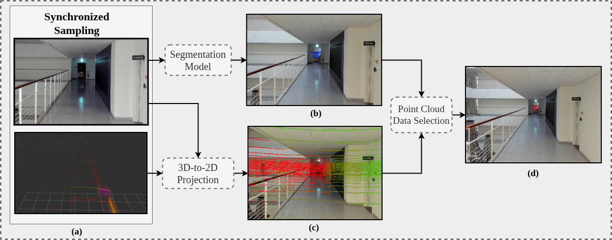

# WICOMAI CV Team - Drone Localization



## Prerequisites

1. Install Python >= 3.12
2. Install Docker
3. Install Git
4. Install ROS2 Jazzy for Ubuntu (https://docs.ros.org/en/jazzy/Installation/Ubuntu-Install-Debs.html) 
5. Initialize submodules dependencies
    ```
    git submodule update --init --recursive
    ```

## Getting Started
### Setup ROS2 Workspace
```bash
# create python venv
python3 -m venv calib-venv
source calib-venv/bin/activate
python3 -m pip install -r requirements.txt


# source the global ros2, tips: put this in ~/.bashrc
source /opt/ros/jazzy/setup.sh


# build ros2 packages in the ros_ws workspace
cd ros_ws
rosdep install -i --from-paths src --rosdistro jazzy -y
colcon build

```

### Build koide3 calib image with docker
```bash
# Build the docker image
cd koide3
docker build -t koide3:jazzy .

# Check images
docker images
```


## Data Collection & Visualization
### Main working directory
```bash
cd ros2-drone-localization/
```
### Collecting sensor data via ROS2
```bash
# source local ros2 installation and launch
source setup.sh
ros_launch_sensors_sync


# utilize rviz2 to visualize the the synced frames (camera and lidar)
rviz2 -f velodyne


# Recording topics
# Topic list:
#   Point Cloud : /sync/velodyne_points
#   Image       : /sync/raw_image
#   Camera Info : /sync/cam_info
ros2 bag record -d 30 -o "$rosbag_record_path" \
/sync/velodyne_points /sync/raw_image /sync/cam_info
```

### Find Lidar-Camera extrinsic calibration params
```bash
# setup path variables
bag_path="$(pwd)/bags/bag_2510291931"
preprocessed_path="$(pwd)/bags_preprocessed"


# running calibration pipeline: 
# preprocess -> inital guess -> calbration
# full example refer to koide3/koide3_cmd_examples.sh
docker run \
  --rm \
  --net host \
  --gpus all \
  -e DISPLAY=$DISPLAY \
  -e __GLX_VENDOR_LIBRARY_NAME=nvidia \
  -v $HOME/.Xauthority:/root/.Xauthority \
  -v $bag_path:/tmp/input_bags \
  -v $preprocessed_path:/tmp/preprocessed \
  koide3:jazzy \
  ros2 run direct_visual_lidar_calibration preprocess -d /tmp/input_bags /tmp/preprocessed
```
Calibration param results [x, y, z, qw, qx, qy, qz] located at: **bags_preprocessed/calib.json**

```json
"T_lidar_camera": [
  -0.10655393864875468,
  -0.8396758913087964,
  -0.5700914608087684,
  -0.46922092315741987,
  0.29491996485073013,
  0.6611417518752516,
  0.5057128864593688
]
```

### Visualize Projection 

```bash
# source local ros2 installation and launch
source setup.sh
ros_launch_projection

# open rviz add add image data from topic /lidar_cam_proj
rviz2 -f velodyne
```

### Visualize Drone Localization 

```bash
# source local ros2 installation and launch
source setup.sh
ros_launch_localization

# open rviz add add image data from topic /lidar_cam_proj
rviz2 -f velodyne
```

<!-- - glfw error 65544: X11: Failed to open display :1 --->
xhost +local:root 


